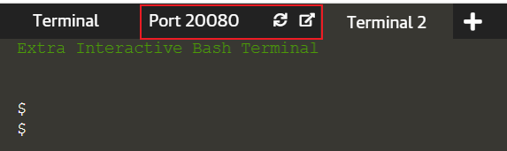
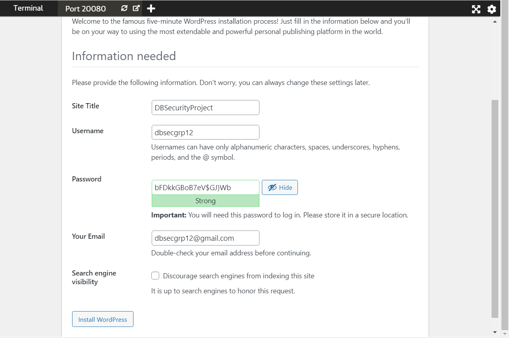
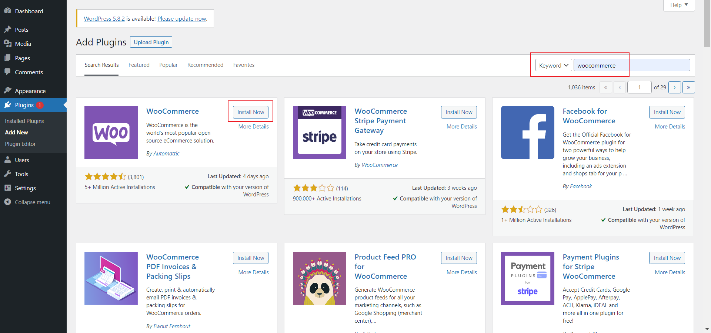
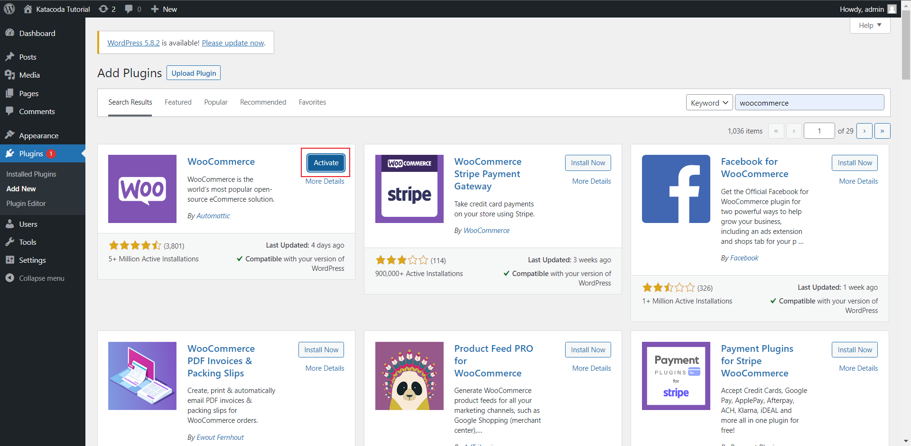
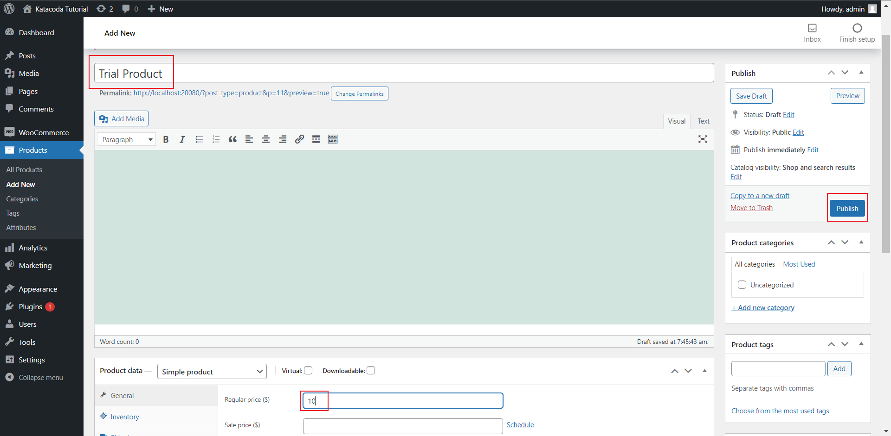

# Setup Wordpress and Woocommerce

So first before we start the tutorial, we have to set up our environment first.
The initial setup has already been made for you, through the docker-compose file.

Simply execute the code below to see the initial setup made.
```cat docker-compose.yml```{{execute}}

As seen from the docker-compose.yml, the wordpress is mapped to port 20080.
There is already a tab provided that connects to port 20080 in katacoda.



It does take time so if it does not work simply refresh.

## Setting up Wordpress
The tab will show you an initial page where you are prompted to pick your language.
Afterwards you will be prompted to enter your username and password.

As this is an admin username and password, make sure that your password is strong to prevent brute force attacks.
Wordpress helps with creating a strong password by randomly generating a password upon sign up. 

Although the best way to keep a password a secret is by remembering it, there are different tools that could help remmeber it for you, for example utilising the browser's password manager https://passwords.google.com/ as one example



It might take a long time, but once you click install wordpress once it should be enough.

Congrats! You have set up Wordpress

## Setting up WooCommerce
For this scenario, we will also be using woocommmerce.

First sign in to the wordpress account, and install the woocommerce plugin.

Step 1: Go to Plugin Menu.


Step 2: Click "Add New" at the top of the page.


Step 3. Search & install the woocommerce plugin


Step 4. Activate the plugin


Step 5. When prompted to fill in the details, simply press skip

You have woocommerce running now!

To test it out, create a product.


You are now ready for the scenario!