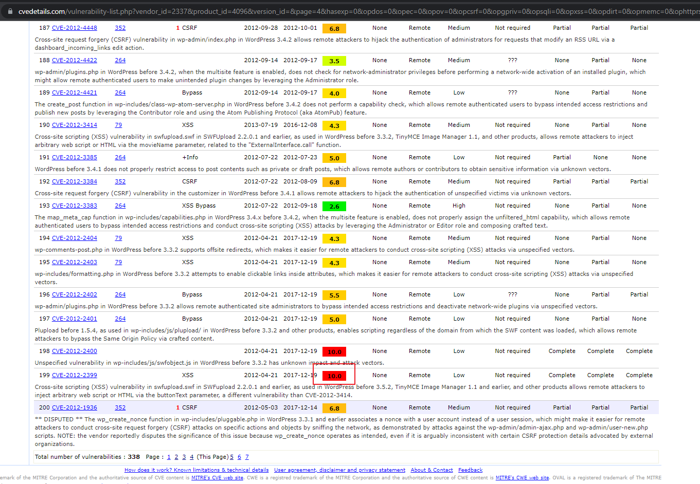
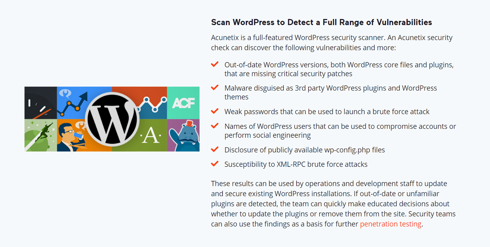

# Updating Plugin

Now that we have come to the end of this tutorial, one important note is to update your plugins!
This is important because whenever a critical vulnerability is found, developers will always try to patch it, it is up to the users to udpate it.

One example is https://developer.woocommerce.com/2021/07/15/developer-advisory-critical-vulnerability-in-multiple-versions-of-woocommerce/
In this article that is released on 15 July 2021, there were critical vulnerabilities related to vulnerable endpoints and read-only sql queries being executed with those endpoints.

Although this vulnerability is not that critical, some of the vulnerabilities can be very dangerous, one example is from wordpress in 2017. It can be seen that it has a critical rating of 10.0

Since it will take a long time to check whether each upgrade patches a high vulnerability, it is important to update all plugins, just in case.

To view other vulnerabiltities, https://www.cvedetails.com/ is a good website to start.

# Other Scanning Tools 
There are other scanning tools that could make your wordpress safer. One of them is acunetix.
https://www.acunetix.com/vulnerability-scanner/wordpress-security-scan/
Acunetix has a lot of capabilities to scan the entire wordpress for vulnerabilities. Here are a few according to their website: 

Additionally, there are also different nmaps that are designed for wordpress:
https://nmap.org/nsedoc/scripts/http-wordpress-brute.html
https://nmap.org/nsedoc/scripts/http-wordpress-users.html
https://nmap.org/nsedoc/scripts/http-wordpress-enum.html

We won't cover this in this scenario, however here is the link to download nmap for further reading: https://nmap.org/download.html
