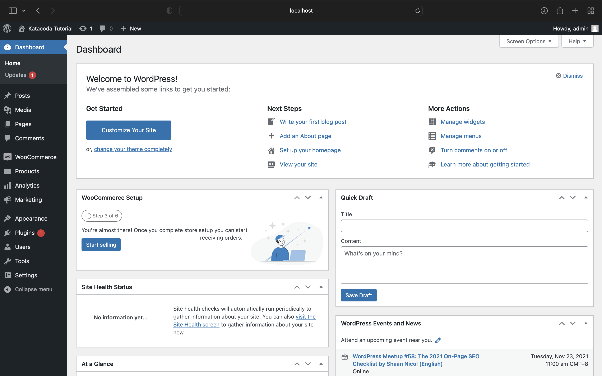
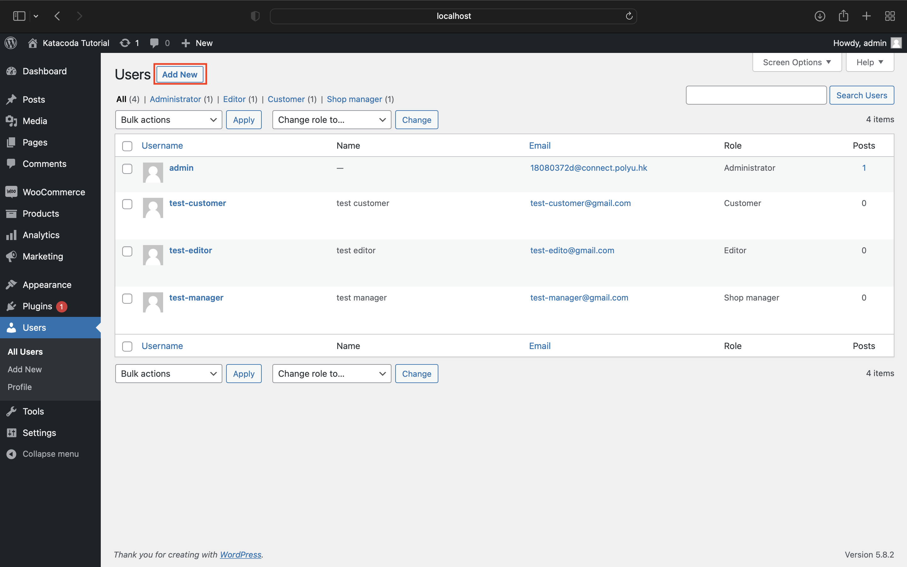
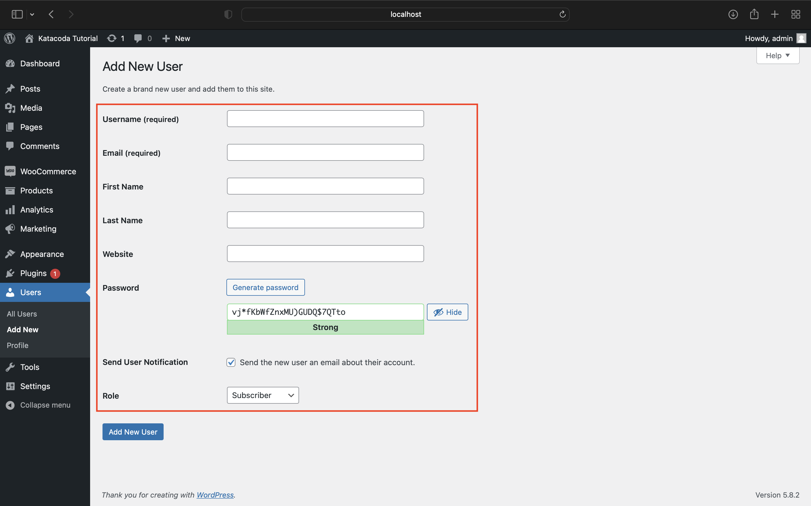
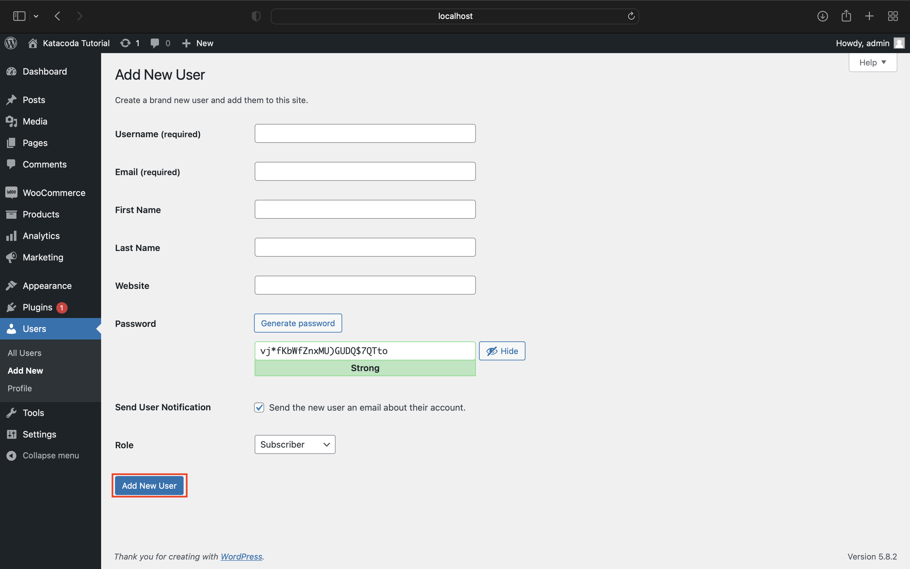

# Privileges

## What is Privileges?

Privileges are permissions that was granted to a user. For example, if a user have the permission to only select and update data in the table, the user will be able to only select and update, they will not be able to create or delete anything in the database.

One of the common cause for data leakage is because a user have too much permissions. If a user has the permission to do anything to the database and he/she did not set up a strong password authentication, it can be easily hacked and the hacker will be able to controll everything inside the database. Thus, granting just enough privilege for certain users to be anle to complete the task is one of the preventative measures against data leakage or data breach.

<br>

## Privileges for MySQL Users

In the next few steps, you will be installing and using Grafana, a centralized dashboard for monitoring logs. Thus, in this step, we will be creating and grating the necessary permission for Grafana.

First, we will create a new MySQL user with the username `grafana` that can login from anywhere with a password `grafana-password`.

```CREATE USER 'grafana'@'%' IDENTIFIED BY 'grafana-password';```{{execute}}

By default, a new user will be granted with the permission 
`USAGE ON *.*` which means that user grafana has no permission to any tables in any database.

Since the user grafana will only be selecting from the table `general_log`, we will only grant `select` permission on that table to user. To do so, run the following command:

```GRANT SELECT ON `mysql`.`general_log` TO `grafana`@`%`;```{{execute}}

<!-- [question] keep or remove? -->
To revoke permissions from a user, execute the following command: 

```REVOKE SELECT ON `mysql`.`general_log` FROM `grafana`@`%`;```

And once the user is no longer needed, deleting the user can done by running the command below:

```DROP USER 'grafana'@'%';```

For more information on MySQL permissions, checkout MySQL documentation for more details: https://dev.mysql.com/doc/refman/8.0/en/privileges-provided.html

<br>

## Privileges for Wordpress/Woocommerce Users

Wordpress and Woocommerce have a built-in UI interface to create new users where you are required to select a role for each user. By assigning  users to different roles, the interface for each user will be different depending on their roles. 

For example, if a user has the role customer, the user will not be able to see the wordpress dashboard or any menu settings. If a user has the role editor, the user will have access to the wordpress dashboard but will only be able to see the posts, medias, pages, and comments. In addition, if a user have the role admin, the user will have access to all the functionalities and settings in the wordpress dashboard.

To create a new user, the user will have to login as admin only because the shop manager will be able to view all users but does not have the permission to add a new user.

Step 1: Go to the Wordpress Dashboard.


Step 2: Go to Users Menu.


Step 3: Click "Add New" at the top of the page.


Step 4: Fill in the form and select a role for the user.


Step 5: Click "Add New User" at the bottom of the page.
