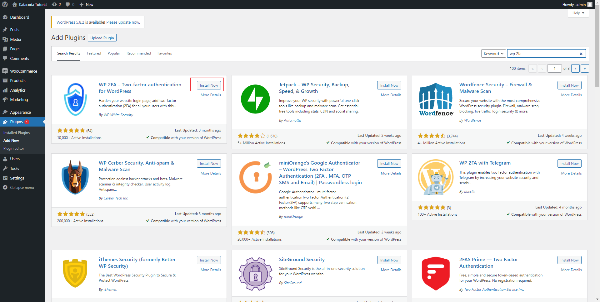
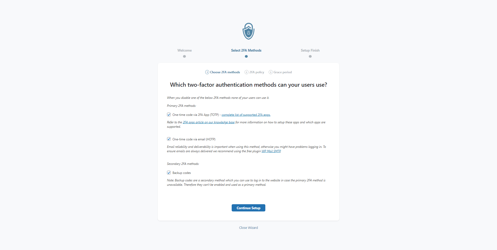
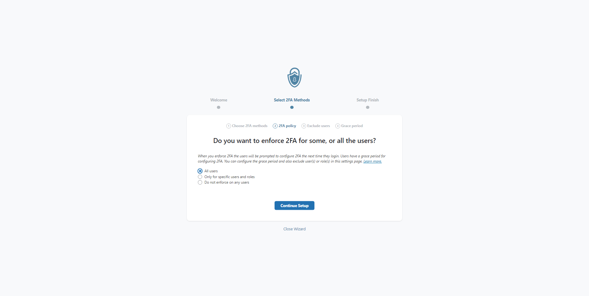
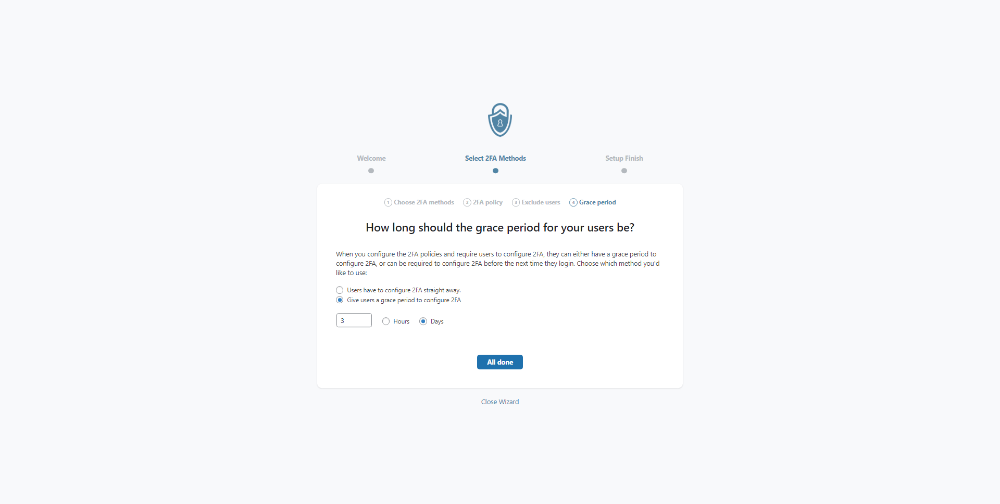
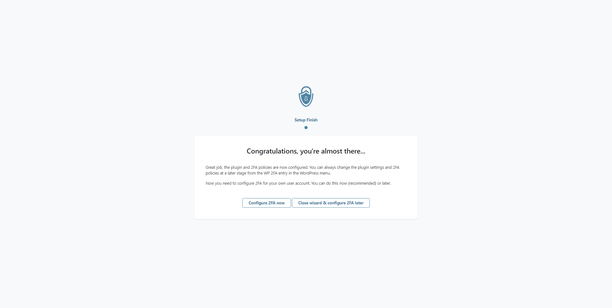
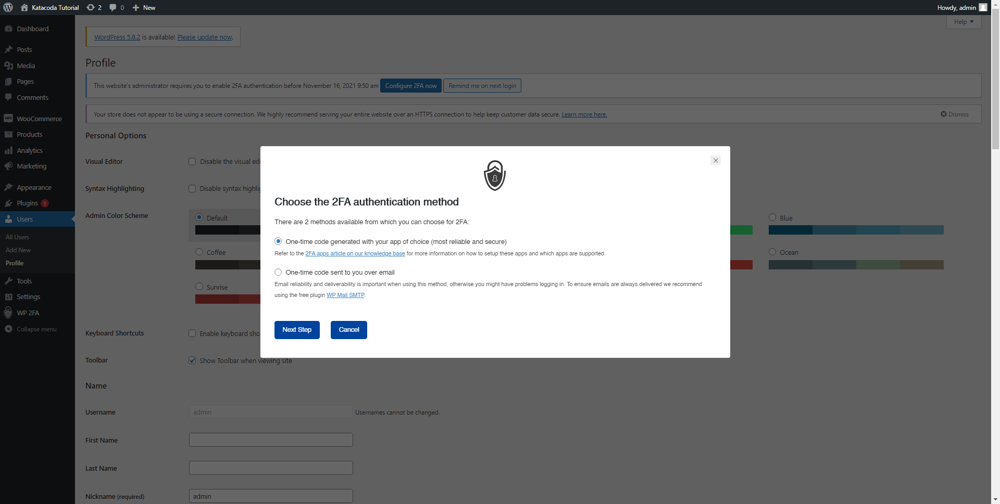
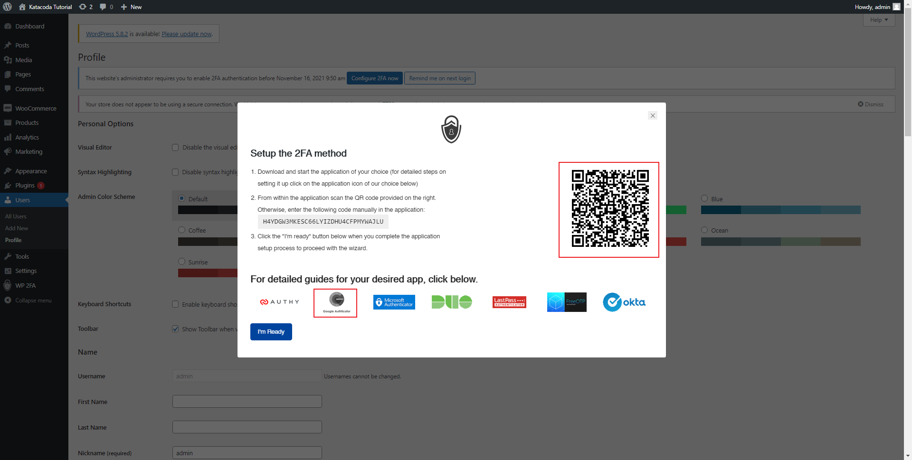
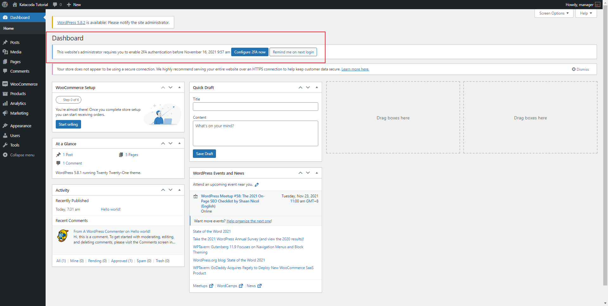

# Improving Password Only Login

Most of the time, even though passwords can be safe, however passwords can be phished or can be randomly guessed. Therefore implementing 2FA is important to give an extra layer of security.

In this section we will use the plugin WP 2FA. https://wordpress.org/plugins/wp-2fa/

## Configure 2FA for Wordpress
Step 1: Search, install and activate the plugin WP 2FA

Step 2: Go through the welcome message and enable the 2FA's

Step 3: Make sure you enforce 2FA for all your users and configure the grace period for how long they can stay without 2FA

After you have configure for the whole wordpress, don't forget to configure for yourself too with the instructions below.

## Configure 2FA for yourself too!
Step 4: Start Configure 2FA for yourself 

Step 5: Download Google Authenticator on your phone! (We will use this for the next step)

Step 5: Use a 2FA Method by scanning the QR Code in the wordpress with your phone (Below is an example of the QR Code)

Step 6: Enter the code from Google Authenticator to the 2FA Method

After setting this plugin, don't forget to remind the other users using the wordpress account. They can configure their own 2FA here

