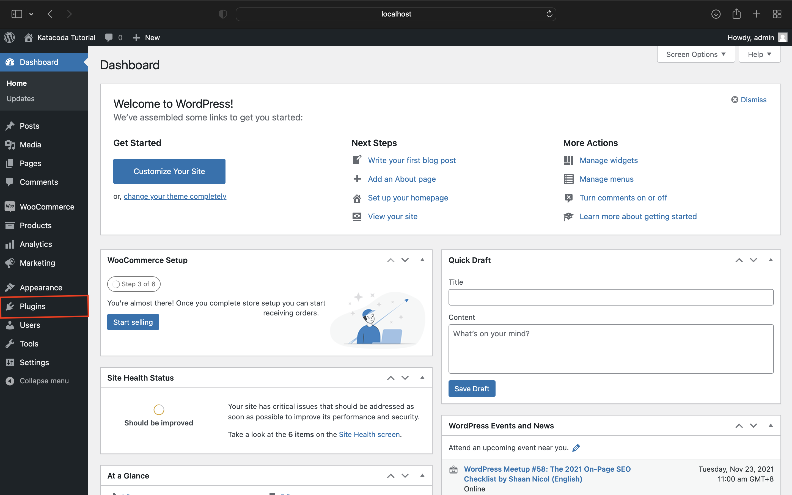
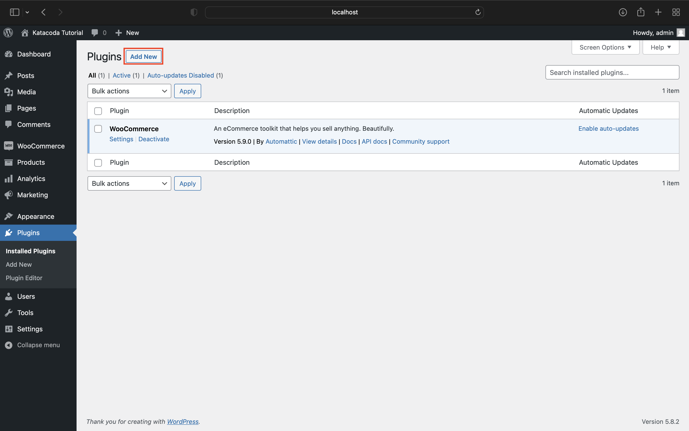
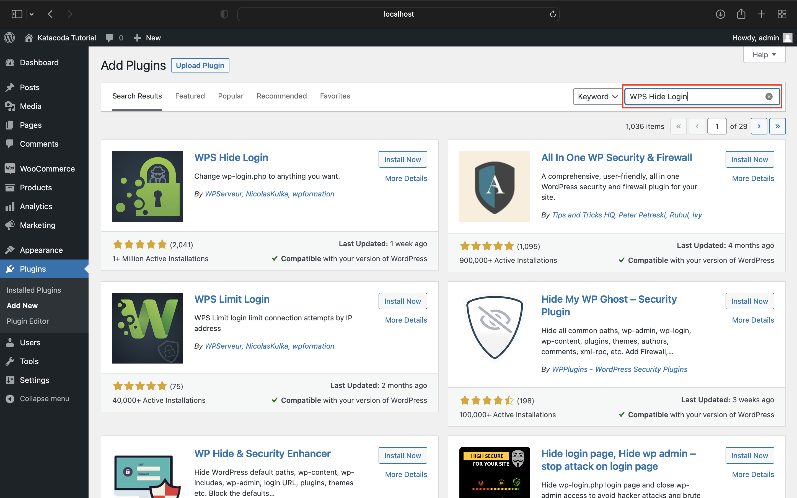
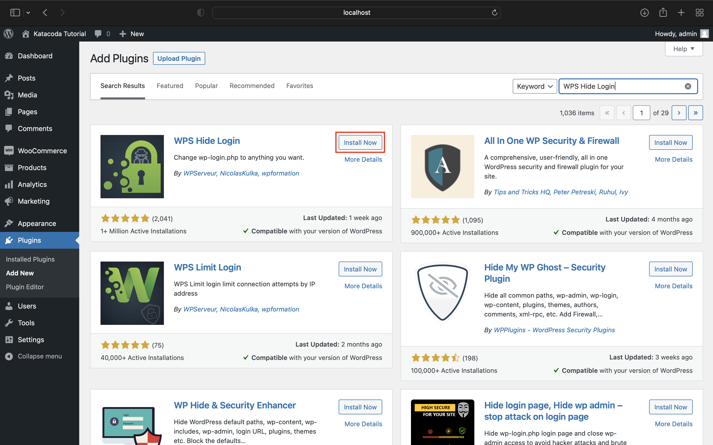
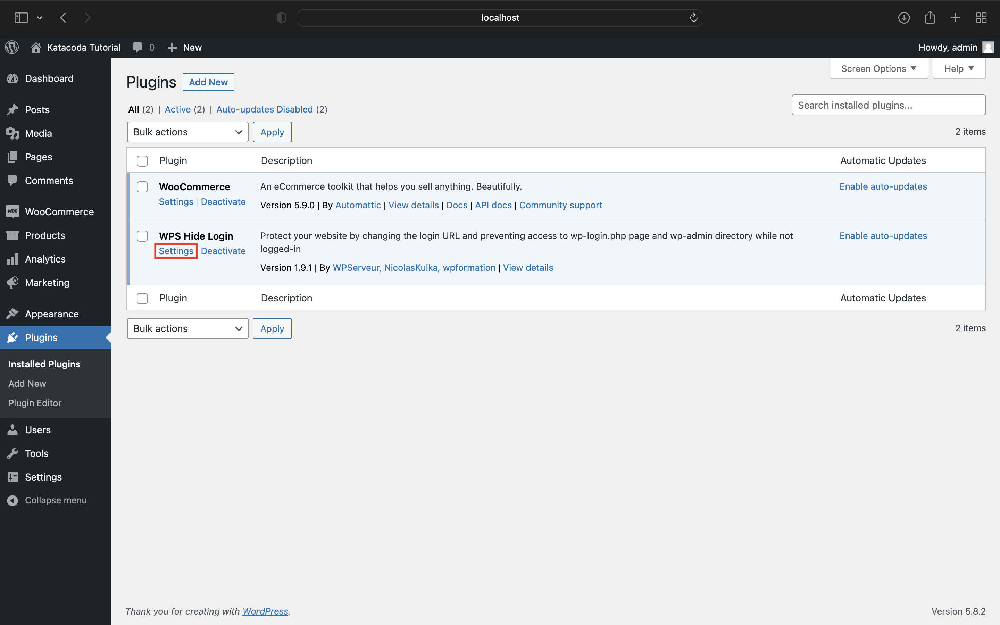
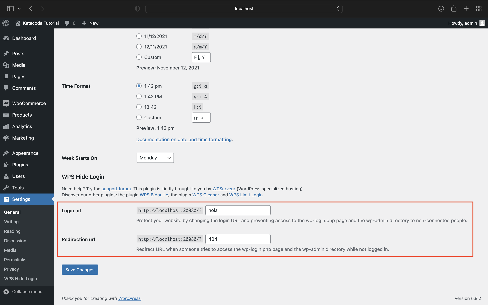
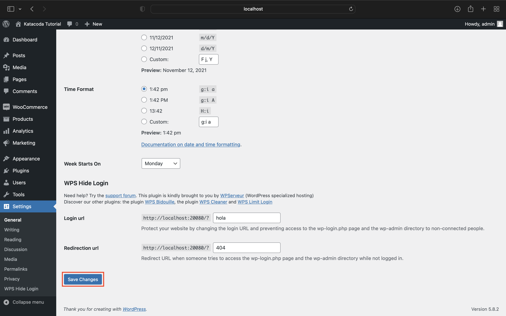

# Change Admin Login Page

One of the ways that normal customer login to Wordpress is by going to the default admin login page like `/wp-admin` or `/login`. Thus, changing the URL of the admin login page is one of the best practices to improve wordpress security.

To change this URL, we have to install the plugin WPS Hide Login from the Wordpress Plugin tab and config the settings.

Step 1: Go to Plugin Menu.

Step 2: Click "Add New" at the top of the page.

Step 3: Search "WPS Hide Login" into the search bar.

Step 4: Install the plugin.

Step 5: Activate the plugin.

Step 6: Open the settings.

Step 6: Configure the setting. In this case, we will change the login page to the URL `/hola`.

Step 8: Click "Save Changes" at the bottom of the page.
