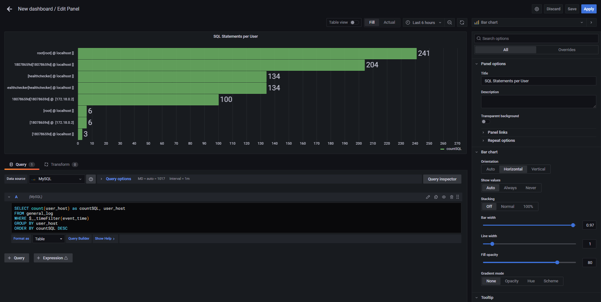
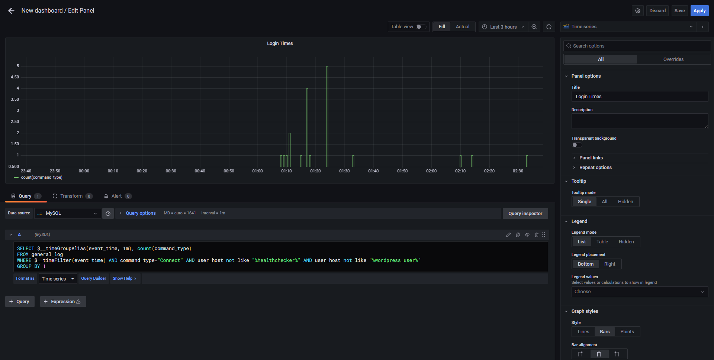

# Using Grafana to Monitor 

Other than preventing illegal access and also giving users just enough privilege, we also need to be able to know how to detect potential problems.

In this section we will talk more about grafana, the monitoring tool that we will be using.

## Preparing MySQL for general_logging
Before we can even use grafana, we would need to enable logging. The logging table needs to be enabled first by using the command 
```set persist general_log = 'on';```
```set persist log_output = 'table';```
in the init.sql
To know more information of what is general_log, here is the link: https://dev.mysql.com/doc/refman/8.0/en/query-log.html

So where is this init.sql file? This is where we would need the information from docker-compose.yml. If you forgot, you can execute
```cat docker-compose.yml```{{execute}}
in order to view the docker-compose.yml again.

We can see that the folder db-init is mounted to mysql. Lets see what is in the folder
```ls db-init```{{execute}}
and we can find that the init.sql is there

to modify this file we can execute the following
```vim init.sql```{{execute}}

and add the following statements above 
```set persist general_log = 'on';```{{execute}}
```set persist log_output = 'table';```{{execute}}

dont forget to restart the container after you modify the init.sql
```docker restart mysql```

## Accessing Grafana and Adding Data Source
First, access the grafana tab as shown:


Second, login when prompted. The default username is ```admin``` and default password is ```admin```
(for demonstration purposes, we left the username and password, however for actuality, you shoudl change the username and password as soon as possible)

You will then be redirected to the homepage of grafana. Click on Add your first data source to add the data source:


Afterwards, search for mysql in the search bar and click mysql.

Set the mysql configurations as below according to the docker-compose:

however, instead of log_user, use ```grafana``` for the username and ```grafana-password```. These are the user we created in the privileges section.

Save and Test to see if it is work and you are good to go!

## Configuring the Dashboard to Log Important Information
Once you have added the data source, time to use it. Click on the + button to create a new panel


This is your dashboard where you view all your statistics. It uses mysql select statements to view your statistics in a simpler way. 
Click the "Add Panel" button on the top right of the window

This will be the default configuration you would see

The first box will be the type of graph that you want it to be.
The second box is where the graph will be displayed at.
The third and last box is where you write your sql statements to be executed.

As we have enabled general_log in the first step, this will help in .
The information we have from general_log table is:


In this scenario we will focus on two panels, which are:
- SQL Statements per User
- Login Times
All which utilise the general_log table data

### SQL Statements per User
SQL statements per user is an important statistics because it helps to show if there are any users who are executing statements more than they should, or it can also indicate if there is an unknown user executing an SQL statment in the database. 

We will use this SQL statement to get the SQL Statements per User:
```SELECT count(user_host) as countSQL, user_host FROM general_log WHERE $__timeFilter(event_time) GROUP BY user_host ORDER BY countSQL DESC```

$__timeFilter() is a function from Grafana so that users can also modify the range of data they want to see. Below is how you modify the time range through grafana


Configure the panel as below:

and you will get a panel to track SQL Statements executed per user

### Login Times
Login Times is also another important statistics because if anyone connects to the database outside of working hours then that might be a red flag.

We will use this SQL Statement to get the login time (healthchecker and wordpress_user is not included in the search as healthchecker regularly connects to the database and wordpress_user regularly connects when a user opens the wordpress website):
```SELECT $__timeGroupAlias(event_time, 1m), count(command_type) FROM general_log WHERE $__timeFilter(event_time) AND command_type="Connect" AND user_host not like "%healthchecker%" AND user_host not like "%wordpress_user%" GROUP BY 1```

Configure the panel as below:

and you will get a panel to track login times.

The final result should be like below:


and you are done!

## Futher Reading
Enabling email alerts is also important as not everyone checks grafana at 2am. Therefore check out this link https://grafana.com/docs/grafana/latest/alerting/old-alerting/notifications/ for more information of how to enable email alerts
