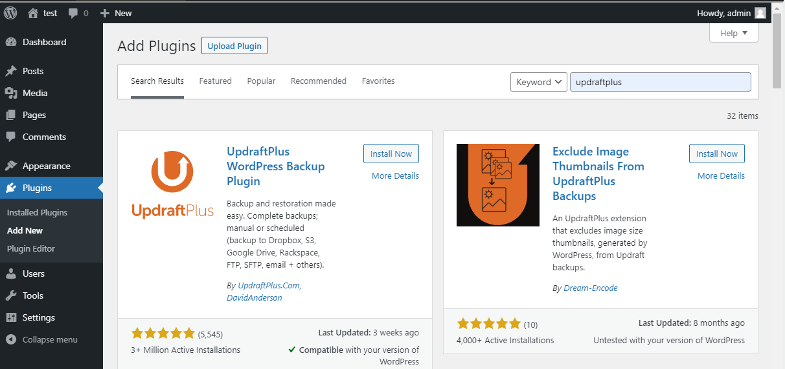
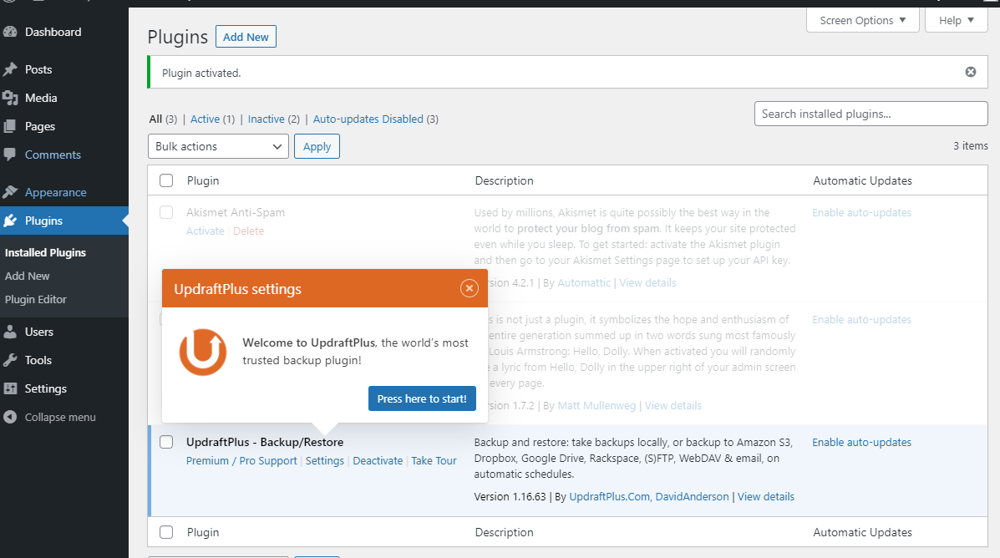
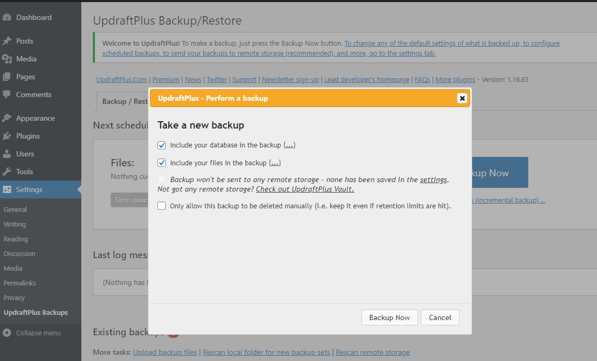
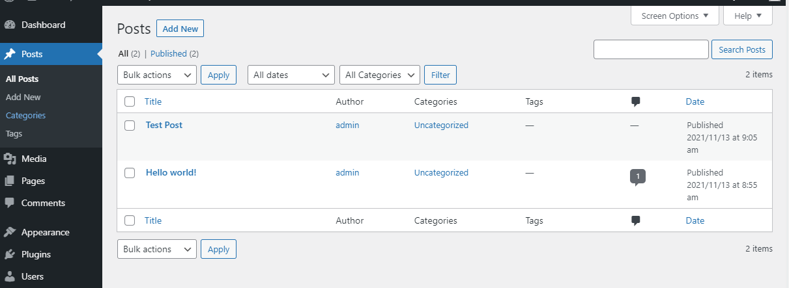
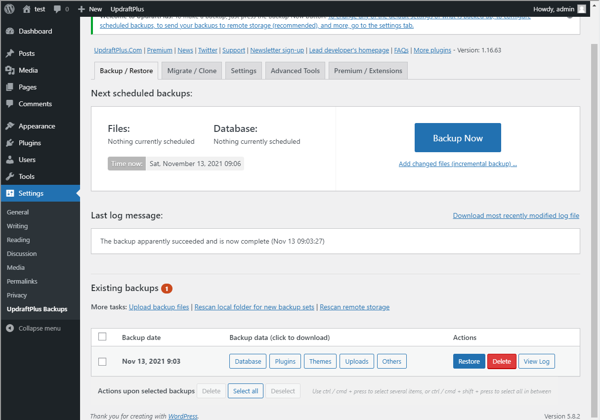
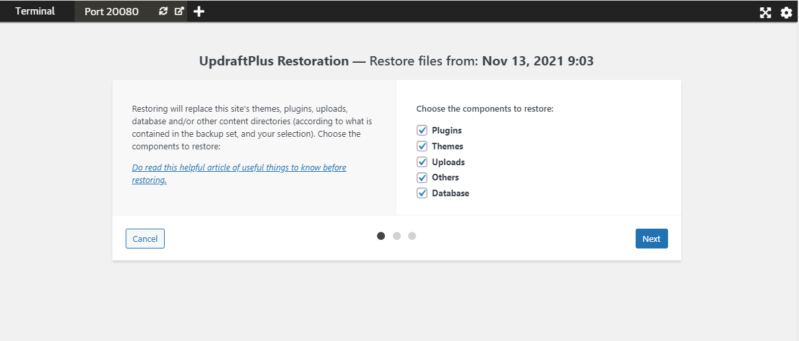
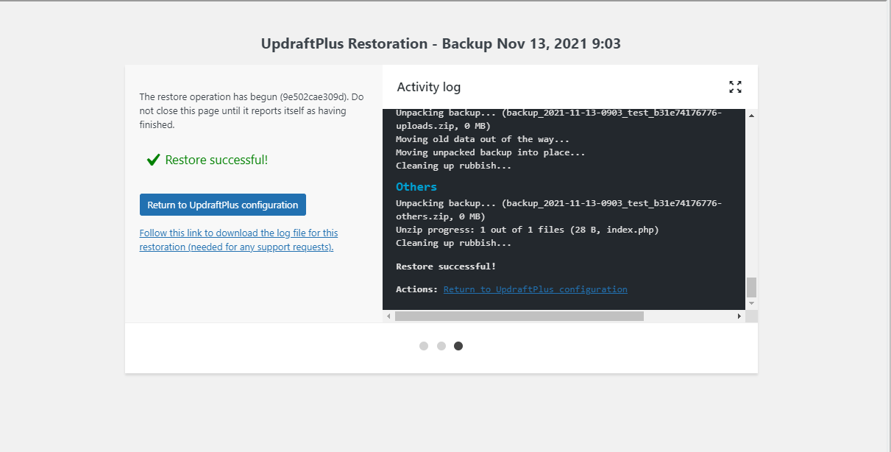
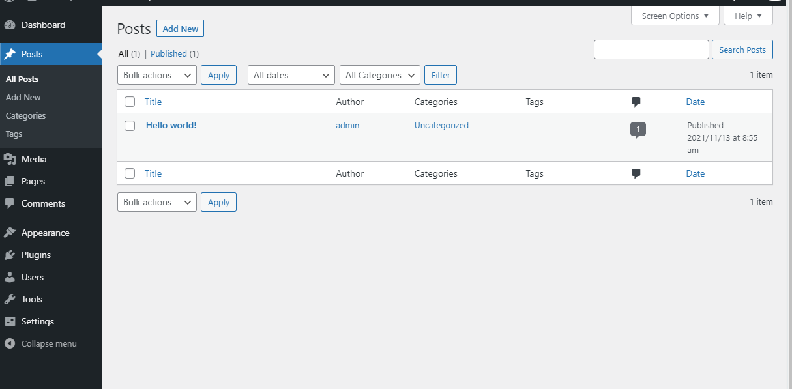

# Backing up wordpress data using UpdraftPlus

The best way to perform backups in wordpress and its plugins is to use a plugin. A popular data backup plugin is UpdraftPlus, due to its features:

- Periodic backup
- Supports backup to different media
- Can selectively backup data
- Has a free version

However, this tool does come with the drawback that several useful tools are locked behind the paid version such as backup encryption and incremental backup.

To set this tool up, we have to install the plugin UpdraftPlus from the Wordpress Plugin tab and config the settings.

Step 1: Go to Plugin Menu and look up "UpdraftPlus", install and activate it.

Step 2: Once installed, follow the setup instructions.

Step 3: Click the "Backup" button and dont change any of the checkboxes. Once completed proceed.

Step 4: To demonstrate, we will create a test post called "Test Post" and save it.

Step 5: Now click the restore button to reverrt back the state of the wordpress.

Step 6: Select all the checkboxes, as you can see, you can selectively recover certain data.

Step 6: Wait for the process to finish, this is what it should look like.

Step 8: Go back to the "post" section and see that the newly created post is no longer there since we backed up to an instance of the database before the post was created .

