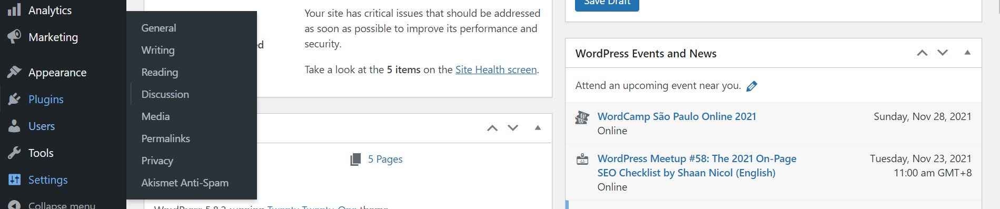
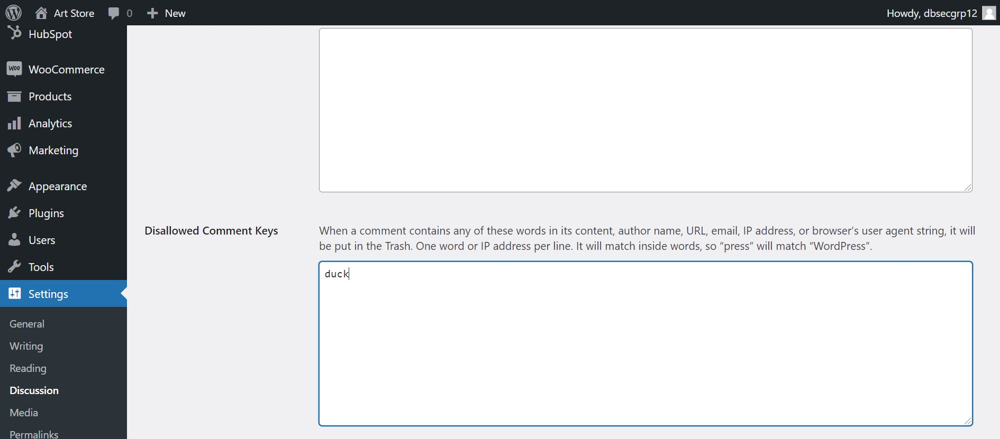
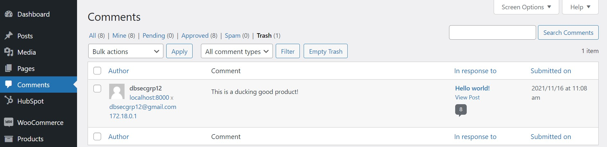
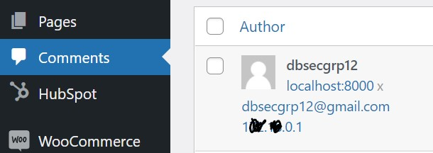
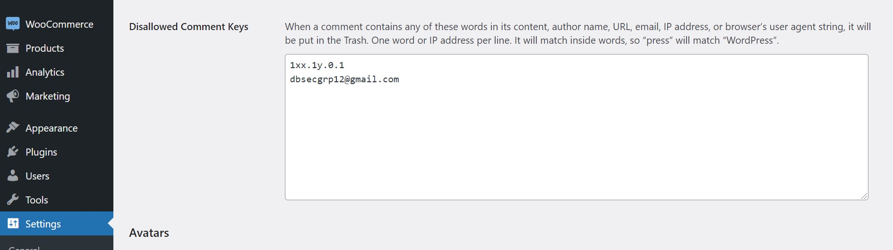

# Blocking or Disabling Comments
Suspicious, inappropraite or spam comments are inevitable on a website. This could be a threat to the users because they may be tricked, and also our company because it ruins the aesthetic layout of the website. 

However, our company still wants to balance between customer interaction and security, therefore we opt for filtering certain comments, and users.

It is your job, to notice different types of risky comments, and put a change to it by following the steps below.

The below are some examples.

## Scenario 1 - Comments with foul language
You have noticed that there are some users who made comments with foul language.

## QUIZ TIME!
>>What do you do?<<
(*) Add the keyword to the list of blacklisted comments
() Block the User from commenting

Scroll to the buttom to "Show Solution" to find the reason to the answer.

Follow the steps below to filter out this comment.

### 1.1 Discussion in Settings
Go to "Settings" and press "Discussion".

### 1.2 Add the keyword to the blacklist
Scroll down to "Disallowed Comment Keys".

Type in the offensive keyword here, so that no future comments contains the same keyword.

Save the changes.

Afterwards, similar comments will be put in the "Trash" Folder in "Comments".

This comment will be removed from the website.

## Scenario 2 - Comments with suspicious links
You have noticed that a user is dropping suspicious links in the comments section.

## QUIZ TIME!
>>What do you do?<<
() Add the keyword to the list of blacklisted comments
(*) Block the User from commenting

Scroll to the buttom to "Show Solution" to find the reason to the answer.

### 2.1 Find the IP address and email address
Instead of adding the keyword to the blacklist, the user poses a threat to the community. 

Hence, we directly add their IP and email address to the blacklist.

Go to "Comments" on WordPress, and copy their IP and email address.

### 2.2 Add the IP address and email address to the blacklist
Similar to step 1.1

Go to "Settings" and press "Discussion".

Add the IP address and email address to the blacklist

This person will not be able to comment on the post again.
