# Creating Email Subscription Forms

Email subscriptions help create a loyal and returning customer base, whenever there are new offers or items in our store, customers can be informed immediately through email subscriptions.

However, nothing lowers subscription rate more than violating customer's privacy, our company needs to hold up the credibility and trust customers' expect. 

In Article 5 of the GDPR, the law states that personal data should be “adequate, relevant and limited to what is necessary in relation to the purposes for which they are processed”. 

In other words, when we design a form for data collection, the forms should only acquire information that is relevant and needed.

>> Therefore, when creating an email subscription form on the website, we should only acquire:<<
[] First and Last name
[ * ] Email address
[] Home address
[] Credit card information

Next, let us go through the steps to create a form on HubSpot.

## Step 1 - Creating a new form
### 1.1 Open forms in HubSpot
Assuming that you have installed HubSpot as a plugin, let us click on "Forms" in the menu.
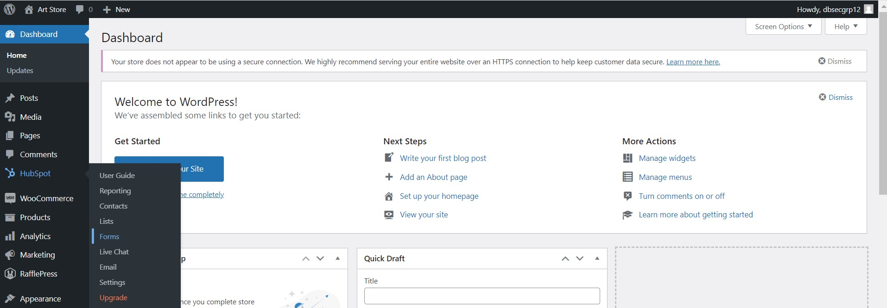

### 1.2 Create new form
Click the "Create Form" button at the top right hand corner.
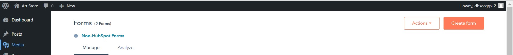

### 1.3 Choose a form type
Choose any form type you like. In this tutorial, "Embedded Form" will be used as the example.

## Step 2 - Adding the contents
### 2.1 Blank template
Numerous templates are provided, but for educational purposes, this tutorial will create a the form without a template.

Click on "Blank Template". Then press "Start" at the top right corner.
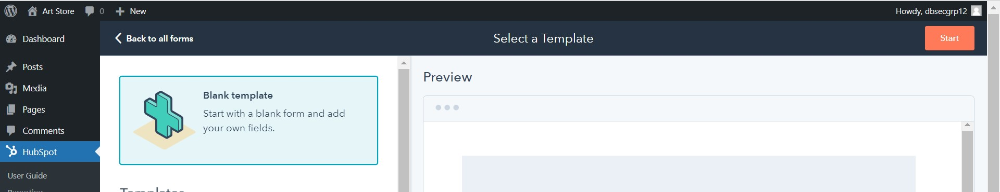

### 2.2 Adding only necessary information
Although there are lots of optons to choose from, such as phone number, address, company name etc. However, as shown in the previous quiz, only email address is the needed information from the user in an email subscription form, other information of the user is not necessary. 
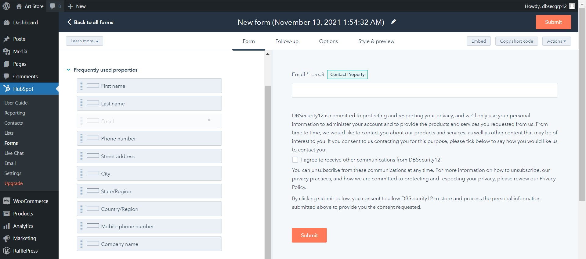

Nonetheless, customer's first name and last name can be added into the form, but the customer should have an option to not fill it in.

To do this, drag and drop the boxes labelled "First name" and "Last name" to the form.
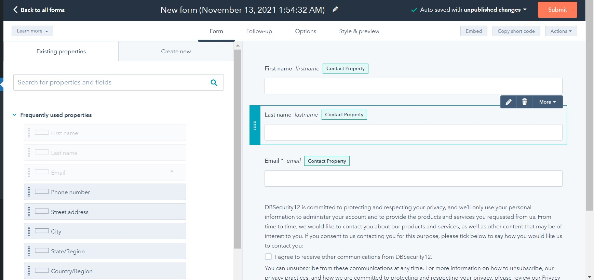

If there are any special cases, where the customer's name is a must, then you can set the value as "Make this field required" by clicking on the boxes.
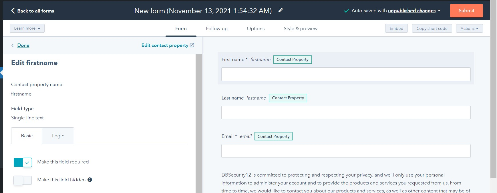

### 2.3 Captcha and GDPR
To prevent spam, scroll down to "Other form elements" and enable "Captcha". This can prevent automated form submissions, reducing spam and the possibility of uploading viruses or other malicious files. It ensures that the submission is being done by a human being. Hence, this must be enabled.

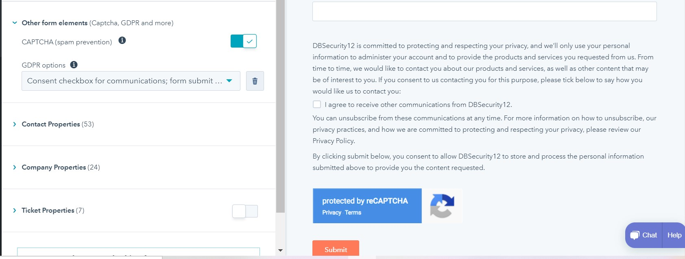

Another thing you may have noticed is the GDPR consent notice on this form. By default, this is enabled for us.

This form is to enquire the customers whether they would like to receive any marketing emails from us. This box is not a compulsory to check for submission. 

Moreover, this notice is to let the customers know how, where, and when there is data will be used. The data is used to inform them the product and services our company provides via email.

### 2.4 Publish form
Click on "Submit" on the right hand corner, then scroll down to click "Publish" to complete editing this form.

## Step 3 - Adding this form to a page
### 3.1 Choose a page
Go to "Pages" on WordPress and click "All pages".
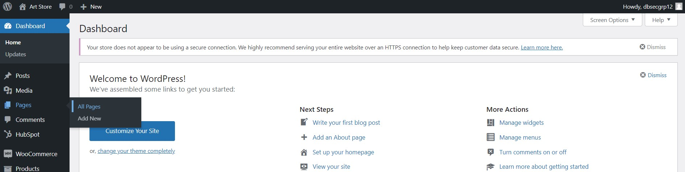

In this tutorial, the form will be added to "My Account". Press "Edit" under the "My Account" page.
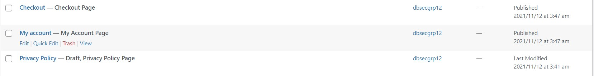

### 3.2 Add HubSpot Form Block
To let the form appear on the website page, click on the "+" box on the bottom right corner, and choose "HubSpot Form".
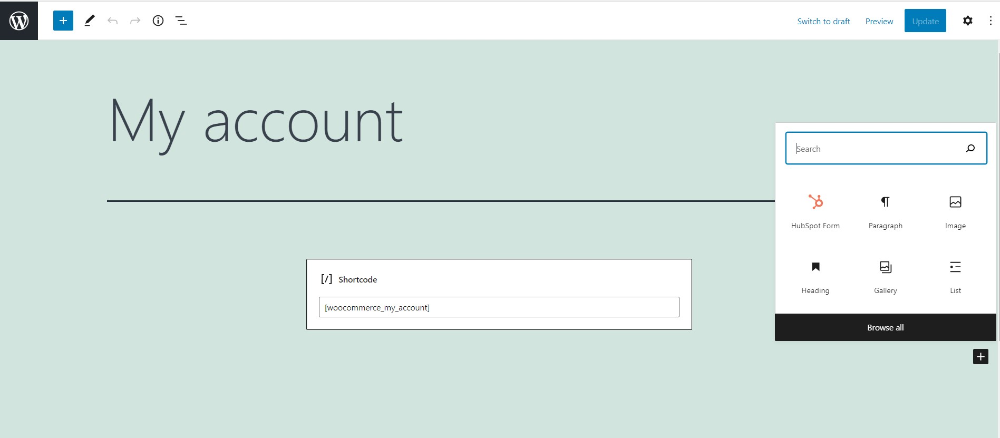

Then, select the form we just created.

Afterwards, press "Update" on the upper right corner.

To preview, press "Preview" on the upper right corner.
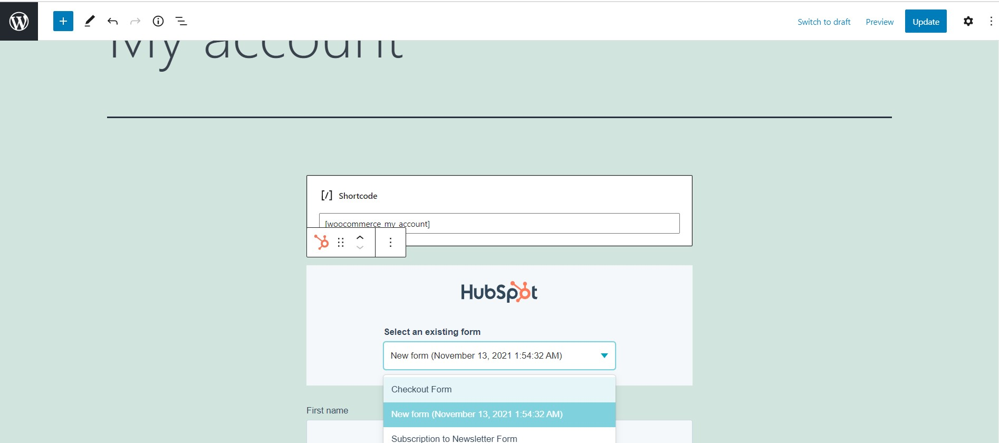

### 3.3 Final outlook
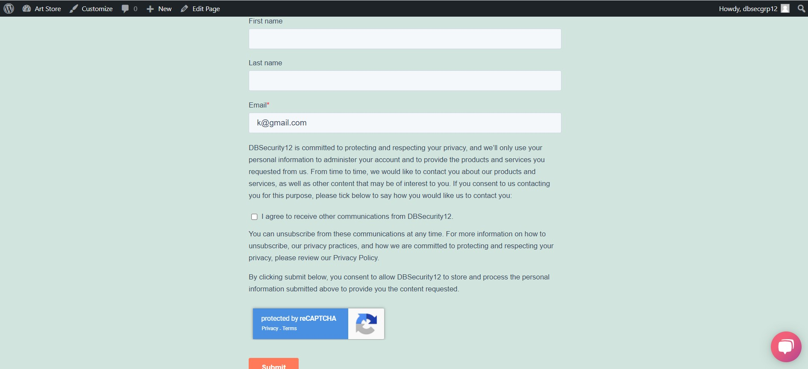

