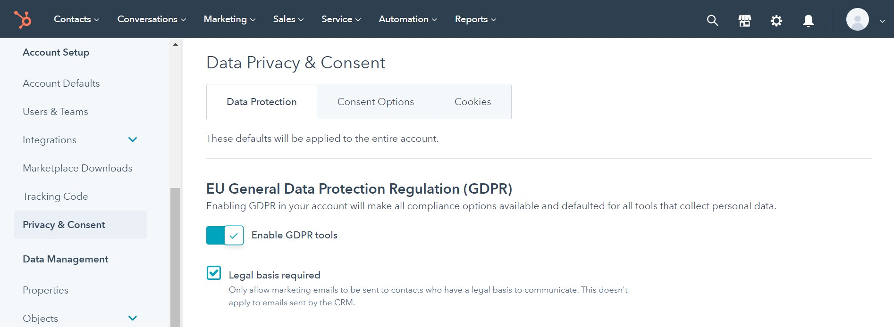
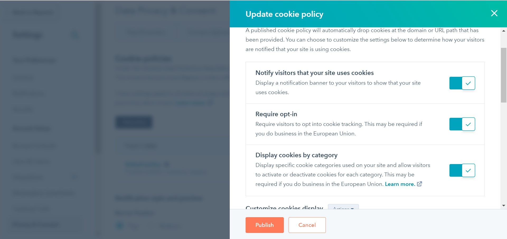
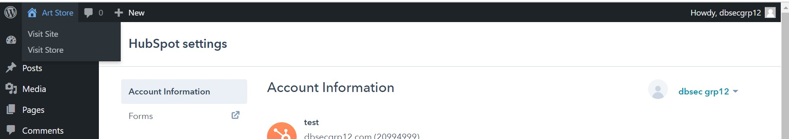
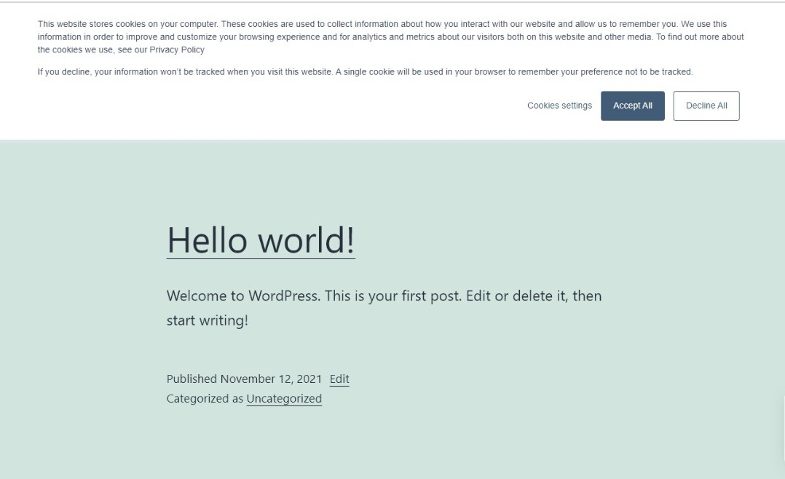

# Creating Cookies Consent on Web UI
As a sales and marketing team member, internet cookies can be very helpful for advertising services to target audience groups, as it can track the user data and behaviour information. 

However, our customers may feel violated to know that their every move is being tracked. They would lose trust in our company, which is not the desired effect.

According to the GDPR, websites need to set up a cookie policy to informs its users on:
1) what data our website collects,
2) what purposes the data is used for,
3) which third parties we share their data with,
4) who is the provider of the cookies,
5) how we store their data,
6) ensure its protection,
7) how users may access, migrate, request rectification or deletion of their data. 

Our website’s cookie policy must be written in an easy-to-understand language and be easily accessible for our users. This tutoral aims to demonstrate how to set up the cookie policy on our website.

## Step 1 - Install plugin HubSpot
Go to "Plugins" and press "Add New".

Search for the plugin "HubSpot" and install it.

Then, go to "Plugins" again but choose "installed plugins" and press "Activate" for "HubSpot".

Log into HubSpot with the email provided by your company, or create a new account and login.

## Step 2 - Settings for Privacy and Consent
## 2.1 Data Protection
Open HubSpot with link [hubspot.com](hubspot.com) on another tab, and press on "Go to My Account". The reason to open it on another tab (instead of in WordPress) is because the User Interface is more complete there.

On the left hand side, press on "Privacy & Consent".

Under "Data Protection", toggle the "Enable GDPR" switch to turn it on. 

Check the box for "Legal Basis Required".

## 2.2 Cookies
Toggle the "Published" button for "Default Policy".

Then, click on "Default Policy", a pop-up window will show up on the right hand side, 

Toggle on the switches to On for "Notify visitors that your site uses cookies" "Require opt-in" "Display cookies by category".

Press Publish.

## Step 3 - Final Look
Go back to Wordpress and visit the website.

The cookies policy should be stated at the top.

