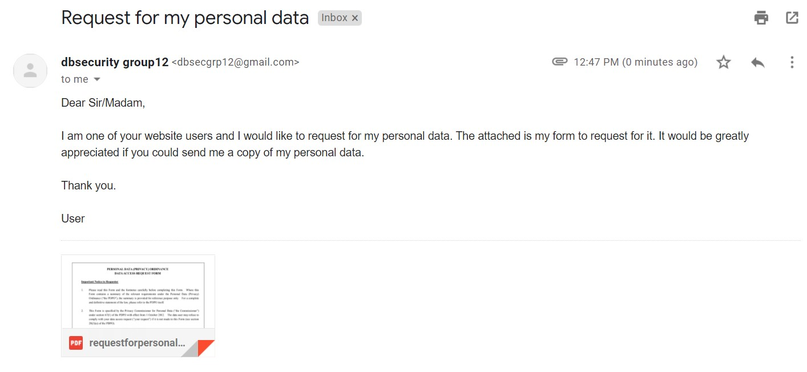
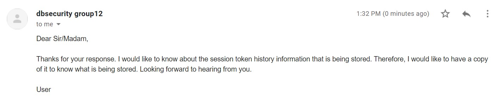
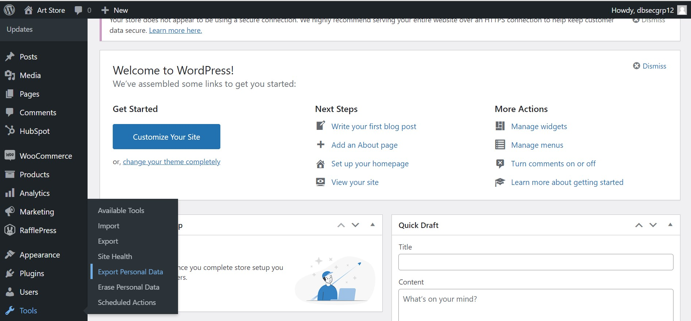
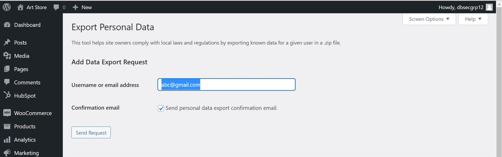
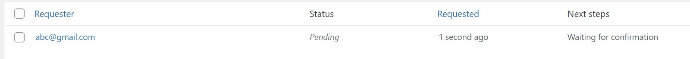
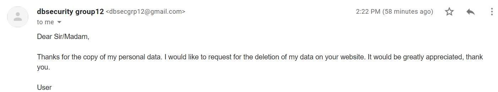
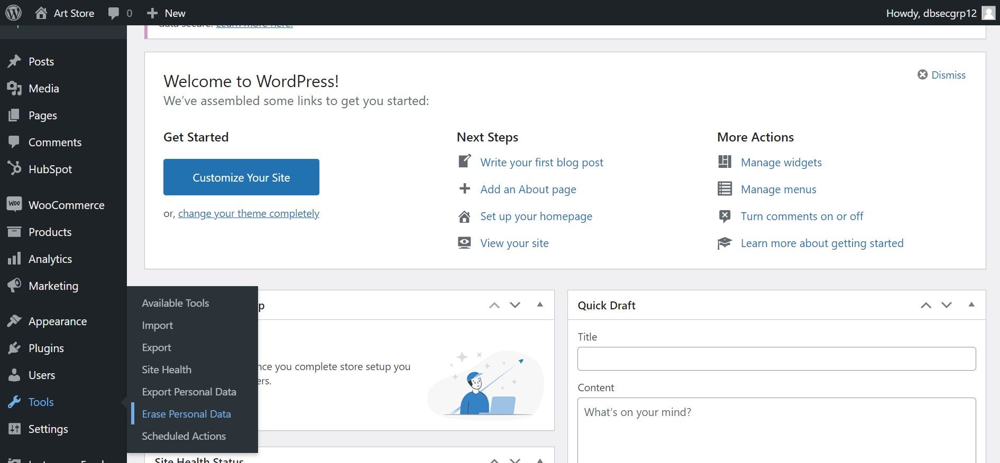
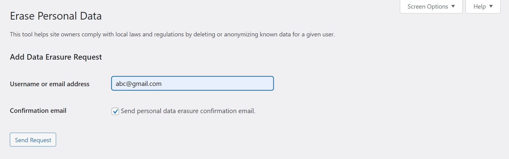
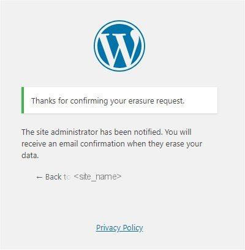
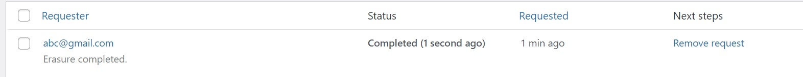

# Exporting and Erasing Personal Data
As a sales and marketing team member, there will be times when you receive emails from customers requesting for their personal data, or maybe you will need their data to complete a task in your job.

WordPress allows you to do this by pressing the "Export Personal Data" function in the "Tools" Section.

However, there are several steps to take before downloading their personal data. This tutorial aims to tell you the steps to take before downloading the personal data.

## Background of Export Personal Data on WordPress
Under GDPR, it states
>#1 Your website users can request access to their personal data (name, email address, comments or any other data submitted to your website)

>#2 Your website users can download and view their personal data (as per Article 15 of GDPR)

>#3 Your website users can request for their personal data to be removed (as per Article 18 of GDPR)

WordPress added the new "Export Personal Data" tool to comply with these rules.

The below is to show you how to use this function for your daily tasks.

## Scenario 1 - Customer Email Requesting for their Personal Data
Today at work, you received this email.

According to the official website of the European Union, a company and organisation should respond to requests as such:
1) confirm whether or not it is processing personal data concerning them;
2) provide a copy of the personal data it holds about them;
3) provide information about the processing (such as purposes, categories of personal data, recipients, etc.)

>>What should you include in your response to the email? <<
[* ] Before our company sends you the data, we would need to know whether the data you are enquiring for is considered as processing personal data or not. It would be great if you could let us know the first.
[] Your request is being processed. We shall send you the data once it is ready.
[] Personal data on the website is considered as company confidential information. We apologise to inform you that we will not be able to send you the personal data.

## Scenario 2 - Customer Responds to your Email
The customer replies.

>>Are session tokens considered as processing data?<<
[* ] Yes because session tokens includes IP addresses, and IP addresses are considered as a part of "processing" operations under EU standards.
[] No because IP addresses are not considered as personal data, so it is not considered as processing data.

## Scenario 3 - Sending the customer a copy of their personal data
First, go to the 

Then, type in the email address of the customer and press "Send Request".

The user will receive an email like the following:
>Howdy,
>
>A request has been made to perform the following action on your account:
>
>Export Personal Data
>
>To confirm this, please click on the following link:
>https://<site_address>/wp-login.php?action=confirmaction&request_id=94&confirm_key=99rqZB4CcRct8JwL55Ov
>
>You can safely ignore and delete this email if you do not want to
>take this action.
>
>Regards,
>All at <site_name>
>http://<site_address>/

After the email is sent out, the status will change to "Pending".

Once the user accepts the request, the status will change to "confirmed".

Now, you can click on "Email Data" to send out the personal data.

The user will receive the following email.
>Howdy,
>
>Your request for an export of personal data has been completed. You may
>download your personal data by clicking on the link below. For privacy
>and security, we will automatically delete the file on <expired_date>,
>so please download it before then.
>
>https://<site_address>/wp-content/uploads/sites/3/wp-personal-data-exports/wp-personal-data-file-xxxxxx.zip
>
>This email has been sent to xxxxx@xxxxx.com.
>
>Regards,
>All at <site_name>
>http://<site_address>

## Scenario 4 - Erasing the customer's personal data
The customer is content to have received the copy of their personal data. However, they would like to make another request on deleting their personal data from our database system. The email is as follow:

Take the steps below to delete their personal data.
Go to "Tools" and click on "Erase Personal Data".

Then, type in the user's email and press "Send Request".

The user will receive the email with the following content:
>Howdy,
>
>A request has been made to perform the following action on your account:
>
>     Erase Personal Data
>
>To confirm this, please click on the following link:
>https://<site_address>/wp-login.php?action=confirmaction&request_id=120&confirm_key=4Ouy5xJDptm4aLwcJIAA
>
>You can safely ignore and delete this email if you do not want to
>take this action.
>
>This email has been sent to xxxxx@xxxxxx.com.
>
>Regards,
>All at <site_name>
>http://<site_address>/

After the user has confirmed, they will see the dialogue box below.

At the same time, the Status of Request will be changed to Confirmed.

Then, click on "Erase Personal Data", the Status will be changed to Completed.

