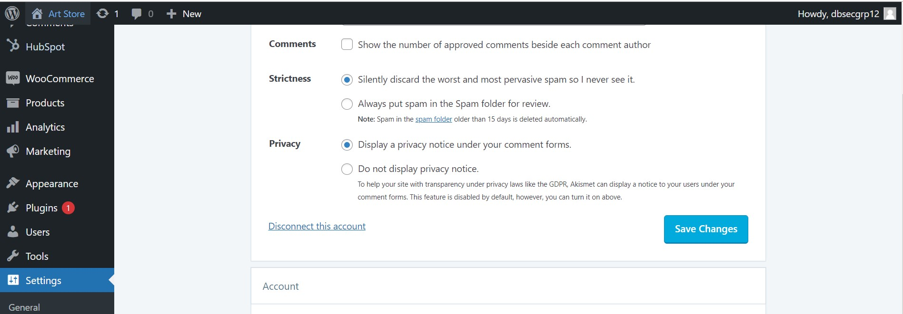

# Anti-spam Email Plug-in

Every business email is prone to spam email, which could affect the professionalism and efficiency of our company productivity, since we will have difficulty in filtering out legitimate emails from customers.

To tackle this, WordPress has automatically installed the "Akismet Anti-Spam" Plugin. This tutorial shows you how to use it.

## Step 1 - Find the plugin

## Step 2 - Activate the plugin
Follow the YouTube tutorial below, to activate and configure this plugin:

https://www.youtube.com/watch?time_continue=267&v=kGAxUjtnpDM&feature=emb_logo

## Step 3 - Configure the settings
Configure the settings to the below:

